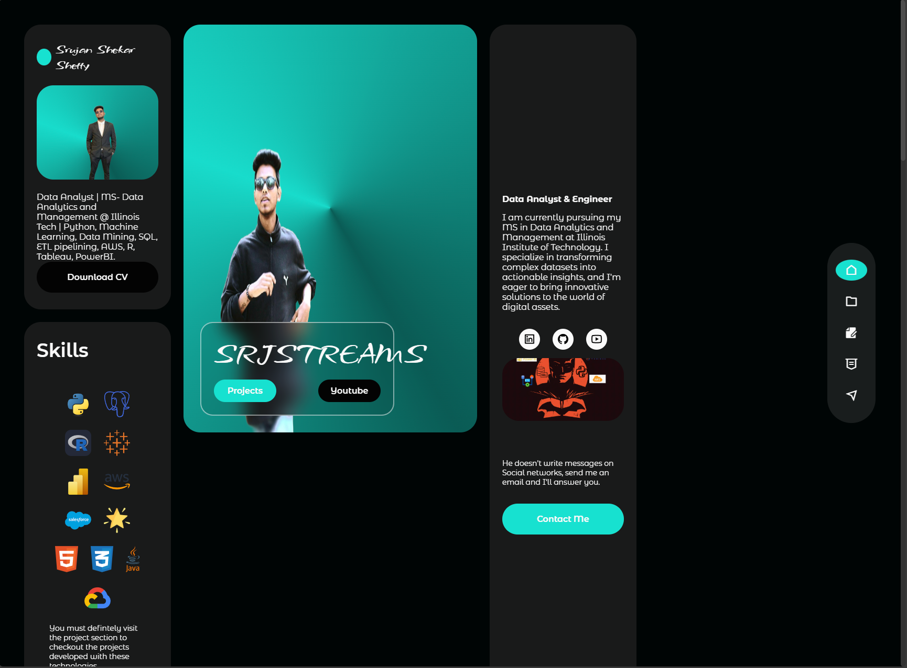

# Portfolio-Responsive-Website


Welcome to my Portfolio Website! This repository contains the source code and resources for my personal portfolio, showcasing my projects, skills, and experiences in the field of data science and web development.

## Table of Contents

- [About](#about)
- [Technologies Used](#technologies-used)
- [Features](#features)
- [Installation](#installation)
- [Usage](#usage)
- [License](#license)
- [Contact](#contact)

## About

This portfolio website is designed to highlight my work and projects, providing potential employers and collaborators with insights into my skills and experiences. It features interactive elements and showcases various projects that I've worked on throughout my career.

## Technologies Used

- HTML5
- CSS3
- JavaScript
- Bootstrap
- [Other relevant technologies/libraries]

## Features

- Responsive design
- Project showcases with detailed descriptions
- Contact form for inquiries
- [Any additional features]


## Screenshot




## Installation

To run this project locally, follow these steps:

1. Clone the repository:

   ```bash
   git clone https://github.com/SrujanSShetty/Portfolio-Responsive-Website.git

2.Navigate to the project directory:

bash
Copy code
cd Portfolio-Responsive-Website

3.Open index.html in your preferred web browser.


### Customization Tips:
- Replace placeholder text (e.g., "your.email@example.com," "Your LinkedIn Profile") with your actual contact information.
- Update the "Technologies Used" section with any specific frameworks or libraries you used.
- If there are additional features or unique aspects of your portfolio, make sure to include them in the "Features" section.
- Feel free to adjust the formatting and sections to match your style! 

Once you've customized it, save it as `README.md` in the root of your repository.
